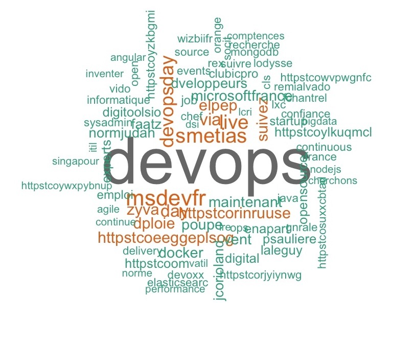

<a href="http://bitly.com/2grT54q"></a> <a href="http://bitly.com/2grT54q"></a> 
 [](https://www.paypal.me/HAAW)

# R_searchandcloud_Function
A R function that make easy to search tweeted word through the api and make a wordcloud

## Requeriement
Please install and load first those library before making usage of the function
library("tm")
library("wordcloud")
library("twitteR")

## Installation
Very simple Drag this function in your R terminal or in you Rstudio IDE

```R
 searchandCloudFR  <- function(s1)
{   
    # Get and store today's Date
    today <- Sys.Date()
    bigdata <- searchTwitter(s1, lang="fr", geocode='46.227638046,2.2137490,500km', since=toString(today), n=1000)
    bigdata_list <- sapply(bigdata, function(x) x$getText())
    bigdata_info <- sapply(bigdata_list, function(row) iconv(row, "latin1", "ASCII", sub=""))
    bigdata_corpus <- Corpus(VectorSource(bigdata_info))
    bigdata_corpus <- tm_map(bigdata_corpus, content_transformer(tolower), lazy=TRUE)
    bigdata_corpus <- tm_map(bigdata_corpus, removePunctuation, lazy=TRUE)
    bigdata_corpus <- tm_map(bigdata_corpus, function(x)removeWords(x,stopwords()), lazy=TRUE)
    bigdata_corpus <- tm_map(bigdata_corpus, removeNumbers)
    # Avoid common english word
    bigdata_corpus <- tm_map(bigdata_corpus, removeWords, stopwords("english"))
    bigdata_corpus <- tm_map(bigdata_corpus, removeWords, stopwords("french"))
    bigdata_corpus <- tm_map(bigdata_corpus, removeWords, c("pas", "cest", "une", "pour", "avec", "sans",
                                                            "un", "sur", "sous", "les", "le", "des", "dans", "quand", "qui", "quoi", "que", "pour", "sont",
                                                            "vous", "nous", "cette", "cet", "ce", "ma", "ta", "sa", "rien", "plus", "moins", "aussi",
                                                            "comme", "comment", "chez", "depuis", "quil",
                                                            "par","suis", "jai", "avais", "veux", "est", "fait", "que", "jvien", "venez",
                                                            "mdr", "bientt",
                                                            "mais", "toi", "lui", "moi","bon", "ah",
                                                            "httpst", "httpstc" ))
    wordcloud(bigdata_corpus, random.order = FALSE, colors = brewer.pal(8, "Dark2"))
}
```
## usage
```R
searchandCloudFR("DevOps")
```
that gives:



## changing setting
This function was made to look tweet only in french you can feel free to change those parameters
```R
    searchTwitter(s1, lang="fr", geocode='46.227638046,2.2137490,500km', since=toString(today), n=1000)
```
